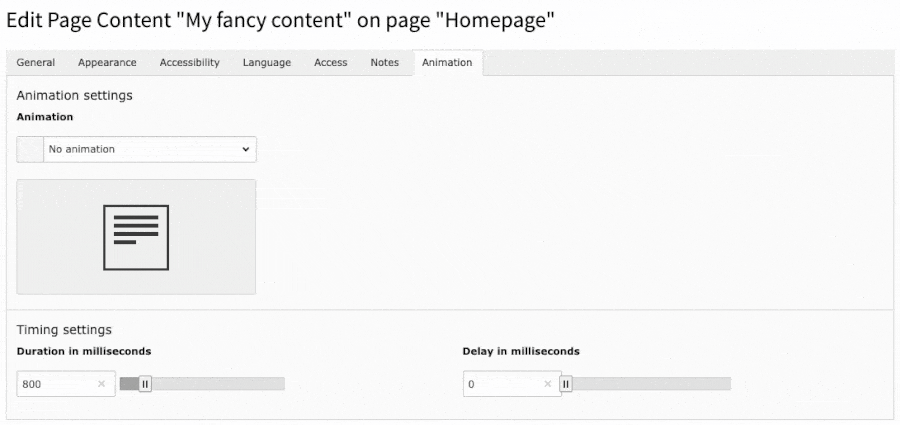

.. include:: ../Includes.txt

.. _editor:

=============
Editor Corner
=============

As an editor, you can set an animation for your content elements by going to the **Animation** tab.

The screenshot below shows how you can set up an animation. You have the option to individually adjust the animation speed and delay of the content element.

.. tip::

   Please check your animation in the frontend to ensure a pleasant appearance for your users when they scroll through your page!

   Elements animating in different directions can be very distracting.

.. note::

   The animations are implemented with GSAP (GreenSock Animation Platform), which provides smooth animations and better performance. The animations are triggered when scrolling both down and up.

Screenshot
==========

   The TYPO3 backend preview of animations right after installation

Available Animation Types
==========================

The following animation types are available:

- **fade-up**: Element appears from below and fades in
- **fade-down**: Element appears from above and fades in
- **fade-left**: Element appears from the left and fades in
- **fade-right**: Element appears from the right and fades in
- **fade**: Element only fades in, without movement
- **zoom-in**: Element becomes larger and fades in
- **zoom-out**: Element becomes smaller and fades in
- **flip-up**: Element flips in from below
- **flip-down**: Element flips in from above
- **slide-left**: Element slides in from the left
- **slide-right**: Element slides in from the right
