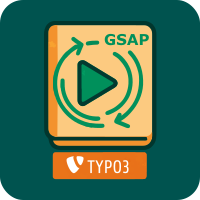

# Content GSAP Animation

## Overview

GSAP (GreenSock Animation Platform) powered animations for your TYPO3 content elements. This extension provides a simple way to add professional, smooth animations to any content element when it enters the viewport. Perfect for creating engaging and interactive websites without writing complex JavaScript.

### What does it do

`content_gsap_animation` is an extension for the TYPO3 content management system.

It allows you to set frontend animations to your content if its scrolled into the browsers viewport with bidirectional animation support (animations play in reverse when scrolling back up).\

### Dependencies
The extension is developed and tested with TYPO3 12.4 until 13.4 LTS. It has an out of the box `bootstrap_package v13, v14 and v15` and `fluid_styled_content` support.

### Configuration
Include the static TypoScript for `Content GSAP Animation: bootstrap_package v13, v14 or v15` or `Content GSAP Animation: fluid_styled_content` to your template and you can start animating.

### Extending
`content_gsap_animation` comes with an extended `Default` fluid layout which adds the necessary markup to get the animations working. If you want to extend the layout just copy it to your extension, remove or update the content elements `layoutRootPaths` and you're good to go.

## Animation System Internals

This section provides details for developers looking to understand or customize the animation system.

### Centralized Animation Definitions

The core GSAP animation keyframes (the `from` and `to` states) are now defined in a centralized JavaScript file:
`Resources/Public/JavaScript/Core/animation-definitions.js`.

If you need to add new animation types or modify the fundamental properties (like starting/ending positions, opacity, scale, rotation, etc.) of existing animations, this is the primary file to edit. Both the backend preview and the frontend rendering use these definitions.

### Enhanced Backend Preview

The animation preview in the TYPO3 backend has been improved to offer a more accurate visual representation of how content elements will animate. Key improvements include:

*   A more content-like placeholder for the preview.
*   The preview now accurately reflects the configured `duration`, `delay`, and `easing` settings selected in the content element's animation configuration.

### Frontend Customization via Data Attributes

While the core animation definitions are centralized, the behavior of individual content element animations on the frontend can be further customized using `data-gsap-*` attributes directly in your Fluid templates or content element markup. These attributes include:

*   `data-gsap-duration`: Overrides the default duration (in milliseconds).
*   `data-gsap-delay`: Sets a delay before the animation starts (in milliseconds).
*   `data-gsap-easing`: Specifies a GSAP easing function (e.g., `power2.inOut`, `bounce.out`).
*   `data-gsap-once`: Set to `true` if the animation should only play once when scrolling down. By default, animations replay when scrolling up and down past the element.

This approach allows for fine-tuning animations on a per-element basis without altering the core definitions.

## More Informations
See the [official documentation](https://docs.typo3.org/p/pixelcoda/content-gsap-animation/main/en-us/) for more details how to implement content_gsap_animation
