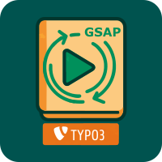
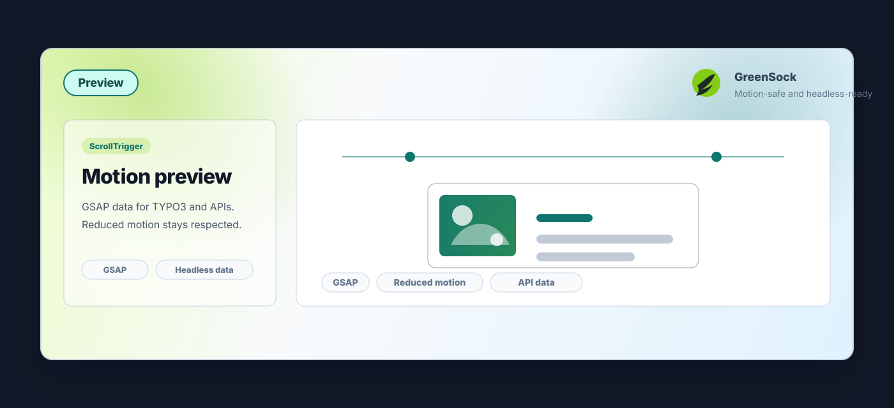

# Content GSAP Animation



GSAP-powered scroll animations for TYPO3 content elements. Editors choose an animation in the content element form; the extension renders the required `data-gsap-*` attributes and initializes GSAP ScrollTrigger in the frontend.



## Highlights

- TYPO3 12.4, 13.4 and 14.3 compatible
- Fluid Styled Content support
- Bootstrap Package v13, v14 and v15 support
- Fade, slide, zoom and flip animation presets
- Backend preview with duration, delay and easing support
- Full-width premium backend preview with GreenSock branding, reduced-motion and headless-state indicators
- Extended settings for offset, anchor placement, once and mirror behavior
- BITV-friendly behavior via `prefers-reduced-motion`
- Headless-ready structured animation data for custom renderers and APIs
- Local vendored GSAP and ScrollTrigger assets, no CDN dependency

## Installation

```bash
composer require pixelcoda/content-gsap-animation
```

Then run TYPO3 extension setup:

```bash
vendor/bin/typo3 extension:setup
```

## TYPO3 Setup

Include the matching TypoScript setup for your rendering stack:

- `Content GSAP Animation: Fluid Styled Content`
- `Content GSAP Animation: Bootstrap Package v13.x`
- `Content GSAP Animation: Bootstrap Package v14.x`
- `Content GSAP Animation: Bootstrap Package v15.x`

The Bootstrap Package number refers to the Bootstrap Package major version, not the TYPO3 major version.

## Editor Usage

Open a content element and use the **Animation** tab. Select an animation preset and adjust timing. If extended settings are enabled in the extension configuration, editors can also set offset, anchor placement, once and mirror behavior.

Existing documentation screenshots:

- [Premium preview](Documentation/Images/Settings/premium-preview.png)
- [Animation tab](Documentation/Images/Settings/animation-tab.png)
- [Extended settings](Documentation/Images/Settings/extended-settings.png)
- [Footer label](Documentation/Images/Settings/footer-label.png)

## Accessibility

The frontend script respects `prefers-reduced-motion: reduce`. If the visitor has reduced motion enabled, animation attributes are ignored and elements remain visible without transform or opacity animation.

## Headless Usage

The data processor now exposes both rendered HTML attributes and structured animation data:

- `animationSettings`: raw HTML attribute string for Fluid layouts
- `gsapAnimationSettings`: legacy raw HTML attribute string
- `animationSettingsData`: structured array for headless/API usage
- `gsapAnimationSettingsData`: legacy structured array alias

Example structured data:

```json
{
  "animation": "fade-up",
  "duration": 800,
  "delay": 0,
  "easing": "power2.out",
  "offset": 120,
  "anchorPlacement": "top-center",
  "once": true,
  "mirror": false
}
```

Custom Fluid layouts can keep using:

```html
{f:if(condition: animationSettings, then: '{animationSettings -> f:format.raw()}')}
```

Headless renderers should consume `animationSettingsData` and decide in the frontend application whether to use GSAP, native CSS, framework-native animation or no animation. Keep the reduced-motion decision in the frontend so API responses stay presentation-neutral.

## Development

Install PHP dependencies:

```bash
composer update --prefer-dist
```

Build JavaScript bundles:

```bash
cd Resources/Public
yarn install
yarn build
```

Run checks:

```bash
composer test
composer test:functional
```

Functional tests require TYPO3 Testing Framework database credentials. With DDEV, use root credentials so the test runner can create temporary databases.

## Documentation

Full documentation is shipped with the extension:

https://github.com/CasianBlanaru/pixelcoda-content-gsap-animation/tree/main/Documentation

The TYPO3 documentation URL can be enabled once docs.typo3.org has indexed the package.
